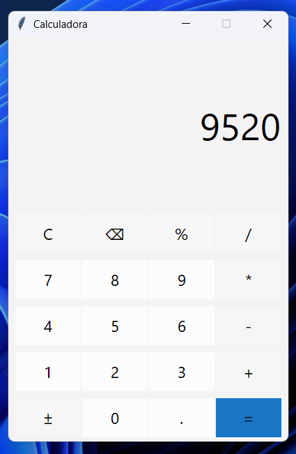
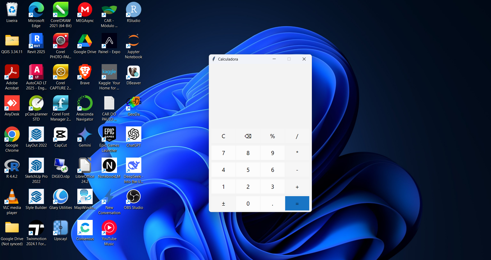

# 🧮 Calculadora Estilo Windows com Tkinter

Aplicativo de calculadora com interface gráfica desenvolvida em Python, inspirado na calculadora do Windows 11.
Projeto simples, funcional e visualmente fiel, com botões estilizados, DPI awareness e compilação para executável (.exe) usando PyInstaller.

## 🚀 Demonstração

<p align="center">
  
</p>

## 🚀 Funcionalidades

- Operações básicas: soma, subtração, multiplicação e divisão
- Porcentagem (%)
- Sinal positivo/negativo (±)
- Limpar (`C`) e apagar último caractere (`⌫`)
- Interface com design moderno (cores e dimensões semelhantes à do Windows)
- Compatível com telas de alta resolução (DPI awareness)
- Geração de aplicativo executável para Windows (.exe standalone)

## 🖼️ Interface

- Fundo: `#f3f3f3`
- Botões numéricos: `#fcfcfc`
- Botões de operação: `#f6f6f6`
- Botão “=”: `#1975c5`
- Tamanhos idênticos à calculadora do Windows (botões de 94×56px)

## 🛠️ Tecnologias Utilizadas

- Python 3.x
- Tkinter (GUI nativa do Python)
- DPI awareness com `ctypes` para melhor precisão visual

## 📦 Como Executar

1. Clone o repositório:
   ```bash
   git clone https://github.com/seu-usuario/calculadora-tkinter.git
   cd calculadora-tkinter
   ```

2. Crie (ou ative) um ambiente virtual e instale o Python se necessário.

3. Execute o app:
   ```bash
   python calculadora.py
   ```

## 🧪 Como Gerar um Executável (.exe)

Com o ambiente ativado, instale o PyInstaller e gere o `.exe`:

```bash
pip install pyinstaller
pyinstaller --noconsole --onefile calculadora.py
```

O executável estará na pasta `dist/`.

## 📷 Captura de Tela



## 📁 Estrutura do Projeto

```
calculadora-tkinter/
│
├── calculadora.py           # Código principal
├── README.md                # Este arquivo
├── docs/
│   ├── screenshot_calculadora.png
```
